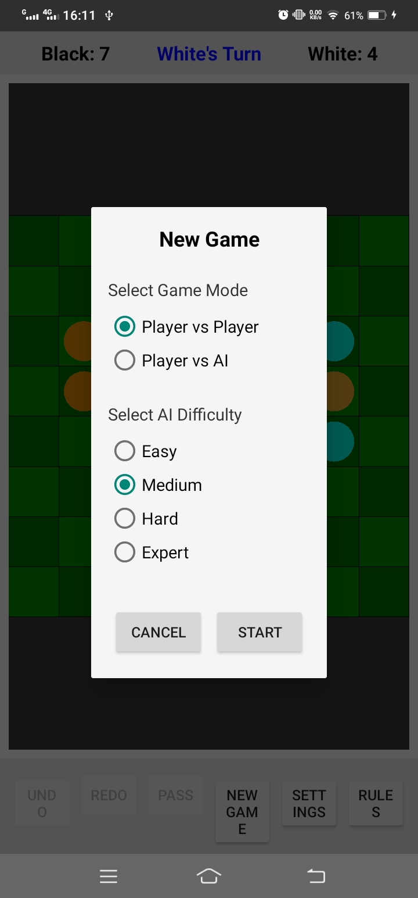

<div align="center">

  # 🎮 Reversi Android

  [](https://android-arsenal.com/api?level=21)
  [](LICENSE)
  [](https://kotlinlang.org)
  [](https://www.android.com)

  **A polished, feature-rich Reversi (Othello) game for Android**

  [⬇️ Download APK](#-installation) • [🎯 How to Play](#-gameplay) • [🤝 Contributing](#-contributing)

</div>

  [](https://android-arsenal.com/api?level=21)
  [](LICENSE)
  [](https://kotlinlang.org)
  [](https://www.android.com)

  **A polished, feature-rich Reversi (Othello) game for Android**

  [⬇️ Download APK](#installation) • [🎯 How to Play](#-gameplay) • [🤝 Contributing](#-contributing)

</div>

---

## 📱 About

Reversi (also known as Othello) is a classic strategy board game for two players, played on an 8×8 board. This Android implementation features smooth OpenGL ES rendering, multiple game modes, smart AI opponents with varying difficulty, and intuitive touch controls.

### ✨ Features

- 🎮 **Multiple Game Modes**
  - 🤝 **Player vs Player** - Local multiplayer on the same device
  - 🤖 **Player vs AI** - Challenge the computer with adjustable difficulty

- 🧠 **Smart AI Opponent**
  - Easy, Medium, Hard, and Expert difficulty levels
  - Intelligent move prediction and strategic thinking
  - Minimax algorithm with alpha-beta pruning

- 🎨 **Beautiful Graphics**
  - Smooth OpenGL ES 1.0 hardware-accelerated rendering
  - Classic green board design
  - Clear piece visualization
  - Vibrant neon move highlighting

- 🎯 **Dual Move Highlighting**
  - Shows valid moves for both players simultaneously
  - **Neon Cyan** highlights for Black player moves
  - **Neon Orange** highlights for White player moves
  - Visual indicators help plan your strategy

- 📊 **Live Game Statistics**
  - Real-time score tracking
  - Turn indicator showing whose move it is
  - Last move highlighting in red

- ⚙️ **Full Game Controls**
  - Undo/Redo functionality with full history
  - Pass turn when no moves available
  - New game with customizable settings

- 🌍 **Multi-language Support**
  - English
  - Japanese

---

## 🖼️ Screenshots

<div align="center">

| Main Menu | Gameplay |
|:---:|:---:|
|  |  |

| Settings | Rules |
|:---:|:---:|
|  |  |

</div>

---

## 🎮 Gameplay

### How to Play Reversi

1. **Initial Setup** - The game begins with 4 discs on the board:
   - 2 Black discs placed at (3,3) and (4,4)
   - 2 White discs placed at (3,4) and (4,3)

2. **Making a Move** - On your turn, place one of your discs on any empty cell that:
   - Is adjacent to one or more of your opponent's discs
   - Forms a line (horizontal, vertical, or diagonal) between your new disc and another of your existing discs
   - All opponent discs in this line are then captured (flipped to your color)

3. **Turns** - Players take turns, with Black always moving first

4. **Valid Moves** - The game automatically highlights all valid move positions:
   - **Neon Cyan circles** show where Black can place a piece
   - **Neon Orange circles** show where White can place a piece
   - Tap on any highlighted cell to make your move

5. **Passing** - If you have no valid moves, your turn is automatically passed to your opponent

6. **Game Over** - The game ends when:
   - Neither player can make a legal move, OR
   - The board is completely full (64 discs placed)

7. **Winner** - The player with the most discs of their color on the board wins!

### Controls

| Action | How to Perform |
|---------|----------------|
| 🖱️ **Place Piece** | Tap on any highlighted (neon) cell that shows a valid move |
| ⏪ **Undo Move** | Tap the "Undo" button to reverse last move |
| ⏩ **Redo Move** | Tap the "Redo" button to re-apply undone move |
| ⏭️ **Pass Turn** | Tap the "Pass" button (automatically handled when no moves) |
| 🆕 **New Game** | Tap the "New Game" button to start fresh |
| ⚙️ **Settings** | Tap the "Settings" button to change language |
| 📖 **Rules** | Tap the "Rules" button to view game rules |

---

## 🛠️ Technology Stack

### Core Technologies

- **Language**: Kotlin 1.9.0
- **Minimum SDK**: API 21 (Android 5.0 Lollipop)
- **Target SDK**: API 34 (Android 14)
- **Build System**: Gradle 8.2 with Android Gradle Plugin 8.1.0

### Libraries & Frameworks

- **OpenGL ES 1.0** - Hardware-accelerated rendering for smooth 60 FPS gameplay
- **JNI (Java Native Interface)** - Bridges Kotlin and C++ for maximum performance
- **CMake** - Native build system for C++ components
- **AndroidX** - Modern, backward-compatible Android libraries

### Native Components

- **C++ Game Engine** - Fast, efficient game logic implementation
- **Minimax AI** - Intelligent computer opponent with alpha-beta pruning
- **Position Evaluation** - Strategic weighting of board positions
- **Mobility Analysis** - Considers move availability and flexibility

---

## 📦 Installation

### Method 1: Pre-built APK (Recommended)

1. Download the latest APK from the [Releases](../../releases) page
2. On your Android device, go to **Settings > Security**
3. Enable **"Install from Unknown Sources"**
4. Locate and tap the downloaded APK file
5. Grant any necessary permissions
6. 🎮 Enjoy playing Reversi!

### Method 2: Build from Source

#### Prerequisites

Before building, ensure you have:
- **JDK**: OpenJDK 17 or higher
- **Android SDK**: API 34 or higher
- **Android NDK**: 25.1.8937393 or higher
- **CMake**: 3.22.1 or higher

#### Build Instructions

```bash
# Clone the repository
git clone https://github.com/nazmul-haque-nihal/Reversi-Android-APK.git
cd Reversi-Android-APK

# Update local.properties with your SDK path (if needed)
echo "sdk.dir=/path/to/your/android-sdk" > local.properties

# Build debug APK
./gradlew assembleDebug

# Build release APK (requires signing)
./gradlew assembleRelease
```

#### APK Locations

After a successful build:
- **Debug APK**: `app/build/outputs/apk/debug/app-debug.apk`
- **Release APK**: `app/build/outputs/apk/release/app-release.apk`

### Method 3: Install via ADB

For developers with ADB (Android Debug Bridge):

```bash
# Enable USB debugging on your device
# Connect device via USB cable

# Install debug APK
adb install -r app/build/outputs/apk/debug/app-debug.apk

# Launch the game
adb shell am start -n com.example.reversi/.MainActivity

# View logs (for debugging)
adb logcat -s Reversi:D
```

---

## 🏗️ Project Structure

```
Reversi-Android-APK/
├── app/
│   ├── src/
│   │   ├── main/
│   │   │   ├── java/com/example/reversi/
│   │   │   │   ├── MainActivity.kt          # Main activity and game controller
│   │   │   │   ├── GameRenderer.kt         # OpenGL ES rendering engine
│   │   │   │   ├── GameSurfaceView.kt      # Custom GLSurfaceView with touch handling
│   │   │   │   ├── ReversiLib.kt          # JNI wrapper for native engine
│   │   │   │   └── Dialogs.kt            # Game dialogs (setup, settings, etc.)
│   │   │   ├── cpp/
│   │   │   │   ├── native-lib.cpp          # JNI bridge to native code
│   │   │   │   ├── GameEngine.cpp          # Core game logic
│   │   │   │   ├── GameEngine.h
│   │   │   │   ├── AI.cpp                 # AI implementation
│   │   │   │   └── AI.h
│   │   │   ├── res/                       # Android resources
│   │   │   │   ├── layout/                # XML layouts
│   │   │   │   ├── values/                # Strings, colors, etc.
│   │   │   │   └── mipmap-*/              # Icons and launcher images
│   │   │   └── AndroidManifest.xml
│   └── build.gradle                       # App-level Gradle configuration
├── gradle/
│   └── wrapper/                          # Gradle wrapper for dependency-free builds
├── screenshots/                            # Game screenshots
│   ├── gameplay.jpeg
│   ├── settings.jpeg
│   ├── main_menu.jpeg
│   └── game_rules.jpeg
├── gradle.properties                       # Gradle configuration
├── local.properties                       # Local SDK path (auto-generated)
├── build.gradle                          # Project-level Gradle configuration
├── settings.gradle                        # Gradle settings
├── gradlew                               # Gradle wrapper script (Unix/Linux/macOS)
├── gradlew.bat                           # Gradle wrapper script (Windows)
├── README.md                             # This file
├── LICENSE                               # MIT License
└── .gitignore                           # Git ignore patterns

```

---

## 🚀 Advanced Features

### AI Implementation Details

The AI opponent uses a sophisticated algorithm combining multiple strategies:

- **Minimax Algorithm** - Looks ahead multiple moves to find optimal plays
- **Alpha-Beta Pruning** - Optimizes search by eliminating unpromising branches
- **Position Evaluation** - Weights board positions based on strategic importance:
  - Corners = highest value
  - Edge cells = medium value
  - Center cells = moderate value
- **Mobility Analysis** - Considers number of available moves
- **Corner Control** - Prioritizes capturing corners (high-value positions)

#### Difficulty Levels

| Level | Search Depth | Evaluation | Description |
|--------|---------------|--------------|-------------|
| **Easy** | 1 move | Basic validation | Random valid moves with basic rules |
| **Medium** | 2-3 moves | Position weights | Strategic thinking with basic heuristics |
| **Hard** | 4-5 moves | Advanced heuristics | Strong opponent with mobility analysis |
| **Expert** | 6+ moves | Full evaluation | Maximum difficulty, very challenging |

### Rendering Engine

- **OpenGL ES 1.0** - Cross-platform, hardware-accelerated graphics
- **Efficient Drawing** - Minimized draw calls for smooth 60 FPS performance
- **Responsive Touch** - Precise coordinate mapping with debounce protection
- **Aspect Ratio Handling** - Correct rendering in both portrait and landscape
- **Vibrant Colors** - Neon highlighting optimized for visibility and aesthetics

### Game State Management

- **Undo/Redo Stack** - Full move history with branch support
- **Persistent State** - Game survives configuration changes (rotation, etc.)
- **Move Validation** - Instant feedback on legal moves
- **Auto Pass Detection** - Automatically handles pass situations
- **Turn Management** - Prevents illegal moves during opponent's turn

---

## 📝 Contributing

We welcome contributions! Here's how you can help make Reversi better:

### 🐛 Reporting Bugs

Before reporting a bug:

1. Check existing issues to avoid duplicates
2. Search for similar problems in closed issues
3. Prepare your bug report with:
   - Clear, descriptive title
   - Detailed description of the problem
   - Steps to reproduce the issue
   - Device model and Android version
   - Screenshots or crash logs if applicable

### 💡 Suggesting Features

Have a great idea for improving the game? Let us know!

1. Check existing feature requests first
2. Create a new issue with:
   - Use case and motivation for the feature
   - Potential implementation approach (if you know)
   - Visual mockups if applicable
   - Benefits to the game experience

### 📤 Submitting Code

Want to contribute code? Awesome! Here's the process:

1. **Fork** the repository to your GitHub account
2. **Create a branch** for your feature or fix:
   ```bash
   git checkout -b feature/amazing-feature
   ```
3. **Make your changes** and test thoroughly on multiple devices/API levels
4. **Commit** with clear, descriptive messages:
   ```bash
   git commit -m "Add: Feature description"
   ```
5. **Push** to your fork:
   ```bash
   git push origin feature/amazing-feature
   ```
6. **Create a Pull Request** with:
   - Description of changes
   - Related issue number (if applicable)
   - Screenshots for visual changes
   - Testing you've performed

### 🎨 Code Style

Follow these guidelines for consistency:

- Follow Kotlin coding conventions (https://kotlinlang.org/docs/coding-conventions.html)
- Use meaningful, descriptive variable and function names
- Add comments for complex logic or non-obvious code
- Test on multiple Android versions (21+)
- Maintain consistent formatting with existing code
- Keep the code clean and readable

---

## 📄 License

This project is licensed under the **MIT License** - see the [LICENSE](LICENSE) file for full details.

### Quick Summary

✅ **You can:**
- Use the code for personal or commercial projects
- Modify the code to suit your needs
- Distribute the code or modified versions
- Sublicense the code to others
- Use the code privately or publicly

⚠️ **Requirements:**
- Include the original copyright notice
- Include the MIT license text in your distribution

❌ **No Warranty:**
- The code is provided "AS IS" without warranties

---

## 👏 Acknowledgments

- **Reversi/Othello** - Classic board game invented in the 1970s
- **OpenGL ES** - Khronos Group for graphics API specification
- **Android Community** - Countless helpful resources, tutorials, and StackOverflow answers
- **Open Source Contributors** - Thank you to everyone who helps improve this project!

---

## 📞 Support & Feedback

### Getting Help

- 🐛 **Bug Reports**: [Open an issue](../../issues/new?template=bug_report.md)
- 💡 **Feature Requests**: [Open an issue](../../issues/new?template=feature_request.md)
- ❓ **Questions**: Use [GitHub Discussions](../../discussions)

### Contact

- 📧 **Email**: nazmul-haque-nihal@example.com (update with your email)
- 🌐 **GitHub**: [nazmul-haque-nihal](https://github.com/nazmul-haque-nihal)
- 📱 **Repository**: [Reversi-Android-APK](https://github.com/nazmul-haque-nihal/Reversi-Android-APK)

---

## 🌟 Star History

If you find this project useful, please consider giving it a ⭐ on GitHub!

[](../../stargazers)

---

## 📊 Project Stats

- **Total Lines of Code**: ~3,000+
- **Languages**: Kotlin, C++, Java (JNI)
- **Platform**: Android 5.0+ (API 21+)
- **Architecture**: MVC with JNI for performance-critical components
- **Development Status**: ✅ Active

---

<div align="center">

  **Made with ❤️ for Android gamers worldwide**

  [⬆ Back to Top](#-reversi-android)

  <br><br>

  [📱 Download APK](../../releases) · [📖 View Documentation](#-technology-stack) · [🐛 Report Issue](../../issues)

</div>
